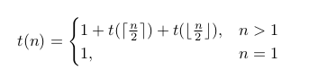

# **A. Analisis Memori**

time limit per test: 1 second\
memory limit per test: 64 megabytes

### **Deskripsi**

Struktur data lanjutan yang banyak aplikasinya di _Competitive Programming_ adalah Segment Tree. Tenang, anda tidak diminta untuk mengimplementasikan Segment Tree. Kali ini, anda akan menganalisis memori yang digunakan di Segment Tree. Secara formal, Segment Tree yang memiliki n buah data akan membutuhkan memori sesuai dengan fungsi berikut:



Catatan: itu merupakan lambang _ceiling_ (pembulatan ke atas) dan _floor_ (pembulatan ke bawah).

Pertanyaannya, jika anda memiliki N buah data, berapakah memori yang akan anda butuhkan?

### **Format Masukan**

Satu baris berisi sebuah bilangan bulat N, banyaknya data.

### **Format Keluaran**

Satu baris berisi sebuah bilangan bulat, banyaknya memori yang diperlukan.

### **Contoh 1**

###### **Masukan**

```
2
```

###### **Keluaran**

```
3
```

### **Batasan**

- $1\le N\le 10^{5}$

---

### **Additional Links:**

[-blue?style=for-the-badge&logo=github>)](https://downgit.github.io/#/home?url=https://github.com/SirPseudocode/competitive-programming-journey/tree/main/Compfest%2018/Coder%20Class/01.%20Pemrograman%20Dasar/F.%20Rekursi/A.%20Analisis%20Memori)

---

<p align="center">
  <small><i>The problem statement, constraints, and test cases are from a Coderclass of CPC <a href="https://compfest.id" target"_blank">Compfest</a> 18.</i></small>
</p>
