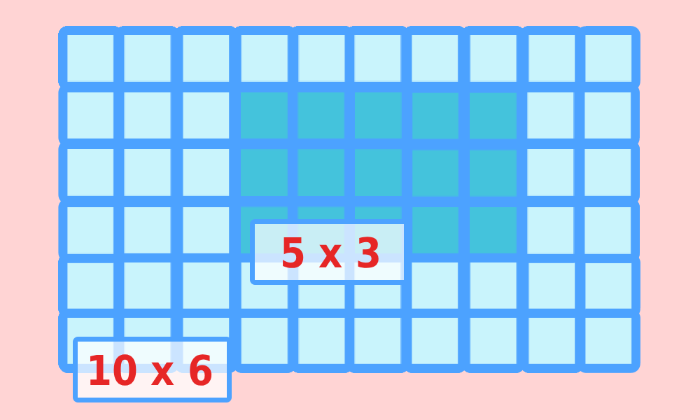

# **Arsitek Amatir**

time limit per test: 1 second\
memory limit per test: 64 megabytes

### **Deskripsi**

Karena bosan, Pak Chanek ingin merenovasi lantai ruang tamunya. Saat ini lantai tersebut berupa mosaik persegi panjang yang tersusun dari $N\times M$ ubin berukuran $1\times 1\text{,}$ dan ia ingin memperluasnya dengan menambahkan beberapa ubin $1\times 1$ baru.

Namun, sebagai seorang arsitek amatir, Pak Chanek yakin bahwa sebuah persegi panjang hanya indah apabila proporsinya tetap terjaga. Oleh karena itu, lantai yang baru harus tetap berbentuk persegi panjang dengan **rasio panjang dan lebar yang sama persis** dengan lantai awal. Sebagai contoh, persegi panjang berukuran $2\times 3$ memiliki rasio yang sama dengan $4\times 6\text{, }6\times 9\text{,}$ dan seterusnya. Selain itu, rasio A : B dianggap sama dengan B : A, karena persegi panjang boleh diputar.

Persegi panjang yang baru harus memiliki luas yang **lebih besar** daripada persegi panjang awal. Akan tetapi, ubin tidaklah murah, sehingga Pak Chanek ingin membeli ubin sesedikit mungkin.

Bantulah Pak Chanek menentukan jumlah minimum ubin $1 × 1$ yang harus ia tambahkan agar dapat membentuk persegi panjang baru tersebut.

### **Format Masukan**

Masukan terdiri dari satu baris yang berisi dua bilangan bulat N N dan M M , yaitu ukuran awal lantai Pak Chanek.

```
N M
```

### **Format Keluaran**

Keluarkan sebuah bilangan bulat yang menyatakan jumlah minimum ubin $1 × 1$ baru yang harus ditambahkan oleh Pak Chanek.

### **Contoh 1**

###### **Masukan**

```
5 3
```

###### **Keluaran**

```
45
```

###### **Penjelasan**

<p align="left">
  
</p>

Lantai awal berukuran $5 × 3\text{,}$ dengan luas 15. Persegi panjang terkecil yang memiliki rasio sama dengan $5 × 3$ dan berukuran lebih besar darinya adalah $10 × 6\text{,}$ dengan luas 60.

Dengan demikian, jumlah ubin tambahan yang diperlukan adalah $60 − 15 = 45\text{.}$

### **Batasan**

- $1\le N, M\le 10^{9}$

---

### **Additional Links:**

[-blue?style=for-the-badge&logo=github>)](https://downgit.github.io/#/home?url=https://github.com/SirPseudocode/competitive-programming-journey/tree/main/Compfest%2018/Preliminary/SCPC/A%20Arsitek%20Amatir)

---

<p align="center">
  <small><i>The problem statement, constraints, and test cases are from SCPC Preliminary <a href="https://compfest.id" target"_blank">Compfest</a> 18.</i></small>
</p>
